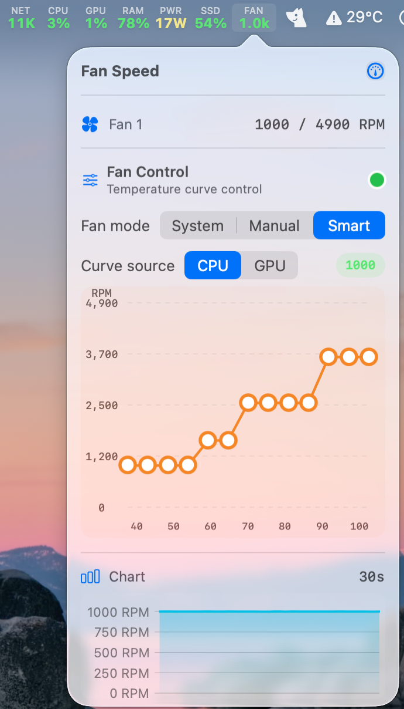
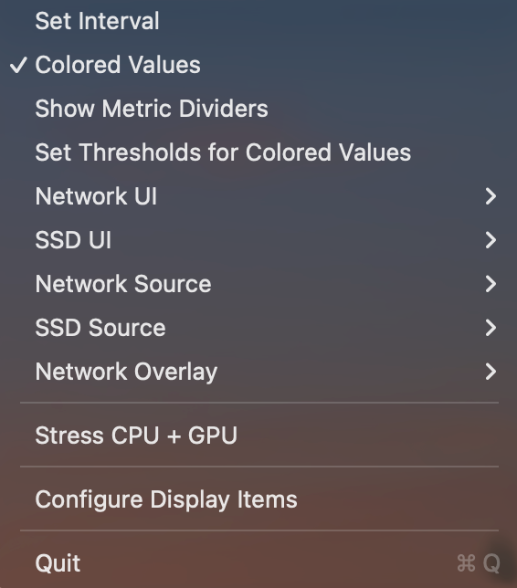

# PowerMonitor

PowerMonitor is a macOS application for monitoring power usage and controlling fans.

## Screenshots

<div align="center">
  
  
  
</div>

## Build Instructions

Before building the project in Xcode, you must compile the `PowerMonitorFanHelper` binary, which is responsible for the fan control capabilities.

1. Open your terminal and navigate to the root directory of this project.
2. Run the following command to compile the Fan Helper:

```bash
swiftc PowerMonitor/Resources/FanHelperSource.txt -o PowerMonitor/Resources/PowerMonitorFanHelper
```

3. Once the binary is compiled and placed in `PowerMonitor/Resources/`, you can open `PowerMonitor.xcodeproj` in Xcode.
4. Build and run the application as usual.
